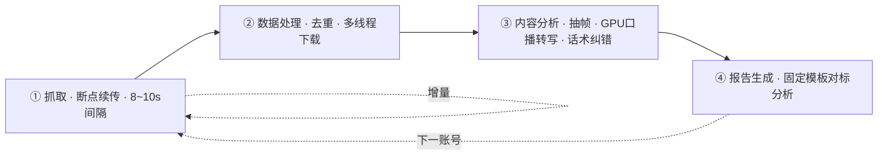

# douyin-crawl-report

> **把一个抖音对标账号「挖透」到极致** —— 抓取 · 去重 · 视觉/BGM/话术分析 · 对标报告，一键全自动。

把「研究一个对标账号怎么火」从几天的苦力活压到**几分钟**：全量抓取 → 去重 → 下载 → 抽帧 → 口播转写（GPU 优先）→ 固定模板对标报告，全程断点续传、按机器配置自适应调度资源，开箱即用。

[](./SKILL.md)
[](./manifest.json)
[](./LICENSE)
[](https://www.douyin.com)
[](./tools/transcribe.py)
[](./references/workflow.md)

---

## ⚡ 3 分钟看懂它 · 流水线一图流



- 详细步骤 → [`references/workflow.md`](./references/workflow.md)
- 命令清单 → [`references/commands.md`](./references/commands.md)
- 报告固定模板 → [`references/report-template.md`](./references/report-template.md)
- 踩坑经验 → [`references/lessons-learned.md`](./references/lessons-learned.md)

---

## 🚀 它替你干了什么

做电商、做内容、做竞品研究的人绕不开一件事：**搞懂对标账号为什么火**。但这通常意味着：

- ❌ 手工一条条录数据、记标题、记点赞，几天才攒成全量样本
- ❌ 逐条听口播、扒话术，纯靠人耳整理
- ❌ 最后只能凭感觉说「TA 内容很牛」，却说不清赢在哪

这个技能把上面全部自动化，产出一份**基于全量真实数据**的对标分析报告，让「抄作业 / 避坑」都有据可依。

---

## 🧩 核心能力

| 阶段 | 能力 | 亮点 |
|---|---|---|
| 抓取 | 单视频 / 整账号批量 | 断点续传 + 8–10s 智能间隔，抗风控；签名失效时浏览器内 `fetch` 直连 API 一次抓全 |
| 去重 | 按 `aweme_id` 去重 + 互动排序 | 只跑增量，断点续传不重复劳动 |
| 下载 | 多线程并行 | 并发按机器配置自适应（默认 `min(核,6)`） |
| 抽帧 | PyAV 1fps（绕开精简版 ffmpeg 无图片编码器） | **多进程并行，实测 3.5× 提速** |
| 转写 | faster-whisper large-v3 | **GPU 自动择优** + 多 worker + `--map` 术语纠错订正口音误识 |
| 报告 | 逐视频 + 全量对标 | 固定模板：定位 / 内容矩阵 / 带货逻辑 / 素材拆解 / 起号方案 |

---

## 🧭 快速开始

### 1. 装载为 Agent Skill
把本仓库安装进技能目录（`.trae-cn/skills/douyin-crawl-report`），通过 `SKILL.md` 触发。

### 2. 触发场景
```text
/抓取我的对标账号：https://v.douyin.com/xxxxxx
```
| 输入 | 输出 |
|---|---|
| 账号主页 URL → | 批量抓取全部视频 → 对标分析报告 |
| 单视频 URL → | 抓取单条 → 逐视频报告 |
| 指定已抓取数据 → | 对标报告（定位 / 矩阵 / 爆款 / 起号方案） |

### 3. 一键流水线（内建 `tools/`，四个脚本均断点续传）
```bash
# ① 给 MediaCrawler 打断点续传补丁（一次性）
python tools/patch_mediacrawler.py

# ② 去重 + 生成下载清单（--json 缺省取最新 jsonl）
python tools/process.py --root <工作根> --account <账号slug>

# ③ 多线程下载视频+封面（并发自适应）
python tools/download.py --root <工作根> --account <账号slug>

# ④ 抽帧 default 1fps（多进程自适应）
python tools/extract_frames.py --root <工作根> --account <账号slug>

# ⑤ 口播转写（GPU 自动择优 + 断点续传 + 可选术语纠错）
python tools/transcribe.py --root <工作根> --account <账号slug> --map term_map.json
```
> `--threads / --workers / --device / --compute` 缺省**按机器配置自动调度**，显式传参可覆盖。

### 4. 环境依赖
```bash
# 基础转写/抽帧 venv（三选一写法即可）
pip install faster-whisper ctranslate2 av pillow
# GPU 加速（ctranslate2 需要，脚本会自动把其 bin 加入 PATH）
pip install nvidia-cublas-cu12
```

---

## ⚙️ 资源自适应调度（`tools/probe.py`）

所有并发不再写死，运行时按机器探测取值：

| 维度 | 探测方式 | 调度规则 | 本机(20核/17G可用/GPU)实测 |
|---|---|---|---|
| CPU | `os.cpu_count()` | 抽帧 `min(核,4)`；下载 `min(核,6)` | 抽帧 4 · 下载 6 |
| 内存 | Windows `GlobalMemoryStatusEx` | 按「可用GB/单worker峰值」封顶防 OOM | 可用 17GB |
| GPU | `ctranslate2.get_cuda_device_count()` | 有 GPU→`cuda/float16` + worker 少；无→`cpu/int8` + 放大 worker | 转写 2 worker |

脚本启动时会打印一行资源快照（如 `[资源] CPU=20核 内存60%(可用17.1GB/42.7GB) GPU=yes -> 下载线程数=6`）。

---

## 📊 实战基准（2026-08 实测）

| 环节 | 结果 |
|---|---|
| 抓取（浏览器 fetch 直连，补全分页参数） | 一次抓全 **9 页 162 条**，不留尾巴 |
| 转写（GPU large-v3） | 单条短视频 **< 0.3s**；空跑快检 **5.5s → 0.2s**（不再白加载模型） |
| 抽帧（多进程 4） | **28.7s → 8.3s**（3.5×），578 帧逐条一致 |
| 术语纠错 `--map` | 「小包私立装→小包分粒装」txt/json 同步订正，零残留 |
| 成功率 | 口播转写 **100%**（error 自动补转，报告前 0 失败） |

---

## 🗂 目录结构

```
douyin-crawl-report/
├─ SKILL.md                  技能定义（触发 + 流程 + 质量护栏）
├─ manifest.json             技能元数据
├─ tools/                    内建一键流水线（可独立运行）
│  ├─ probe.py               资源自适应调度（CPU/GPU/内存）
│  ├─ process.py             去重 → manifest.json
│  ├─ download.py            多线程下载视频+封面
│  ├─ extract_frames.py      PyAV 多进程 1fps 抽帧
│  ├─ transcribe.py          faster-whisper GPU 转写 + --map 纠错
│  └─ patch_mediacrawler.py  MediaCrawler 断点续传补丁
├─ references/               文档 + 固定报告模板
└─ LICENSE
```

---

## 🛡 质量与合规

- **固定报告模板**：对标报告严格遵循 `references/report-template.md`，只换数据不换骨架
- **人工精校兜底**：大模型转写 ≠ 终稿，产品名/工艺/茶底等专业名词报告引用前人工校对口音误识
- **仅抓公开信息**：遵守抖音平台规则与法律边界，不做平台逆向、不做大规模爬虫
- **视觉必须真实**：报告用图取真实抽帧与封面，不用 AI 生成图冒充

---

## 📄 LICENSE

[MIT](./LICENSE)

---

<p align="center">
  📦 一个 Skill，挖透一个账号 · **数据驱动对标，拒绝拍脑袋**
</p>