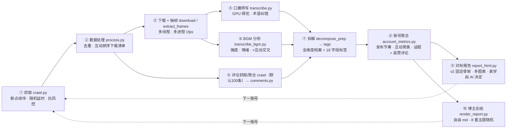

# douyin-crawl-report

> **把一个抖音对标账号「挖透」到极致** — 抓取 · 去重 · 抽帧 · 口播转写 · BGM 分析 · 评论洞察 · 单视频拆解 · 账号级总结 · 对标报告，一键全自动。

把「研究一个对标账号为什么火」从几天的苦力活压到 **几分钟**：全量抓取 → 数据处理 → 下载 → 抽帧 → GPU 口播转写 → BGM 归档 → 评论区洞察 → 逐视频拆解 → 账号级聚合 → 固定模板对标报告。全程断点续传、按机器配置自适应调度、运行库装项目目录经全局指针复用，开箱即用。

[](./SKILL.md)
[](./manifest.json)
[](./LICENSE)
[](https://www.douyin.com)
[](./tools/transcribe.py)
[](./references/workflow.md)

---

## ⚡ 流水线一图流



- 详细流程 → [`references/workflow.md`](./references/workflow.md)
- 命令速查 → [`references/commands.md`](./references/commands.md)
- 报告固定模板 → [`references/report-template.md`](./references/report-template.md)
- 博主总结提示词 → [`references/blogger-summary-prompt.md`](./references/blogger-summary-prompt.md)
- 踩坑经验 → [`references/lessons-learned.md`](./references/lessons-learned.md)

---

## 🚀 它替你干了什么

做电商、做内容、做竞品研究的人绕不开一件事：**搞懂对标账号为什么火**。但通常意味着：

- ❌ 手工一条条录数据、记标题、记点赞，几天才攒成全量样本
- ❌ 逐条听口播、扒话术，纯靠人耳整理
- ❌ 最后只能凭感觉说「TA 内容很牛」，却说不清赢在哪

这个技能把上面全部自动化，产出一份 **基于全量真实数据** 的对标报告与博主总结，让「抄作业 / 避坑」都有据可依。

---

## 🧩 核心能力

| 阶段 | 工具 | 亮点 |
|---|---|---|
| 抓取 | `crawl.py` | 每次调用自动新建独立运行目录；账号主页 / 单视频 / 搜索全模式；默认每视频抓取 100 条一级评论；`--no-comment` 可显式跳过；断点续传、并发档、随机延时与失败重试 |
| 数据处理 | `process.py` | 按 `aweme_id` 去重 + 互动排序，只跑增量不重复劳动 |
| 下载 | `download.py` | 多线程并行，并发按机器自适应 |
| 画面分析 | `extract_frames.py` + `analyze_frames.py` | 最低 12 点 + 首三秒/镜头突变/低置信度加密，自动聚合画风、色彩、构图、场景、字幕与产品露出候选 |
| 口播转写 | `transcribe.py` | 直接复用抓取 JSON 的音乐音频 URL；低置信度标记后再结合自适应抽帧字幕核验 |
| BGM 分析 | `transcribe_bgm.py` | 复用同一音频缓存做能量包络与情绪分析，不再从 MP4 分离音频 |
| 评论洞察 | `crawl.py` → `comments.py` | 批量补抓评论，按赞聚合截断，进档案做需求洞察 |
| 单视频拆解 | `decompose_prep.py` | 标题/时长/时间/互动/口播/帧/BGM/评论全维度档案 + 18 字段标准化标签 |
| 账号聚合 | `account_metrics.py` | 自动产出 **发布节奏 · 互动交叉聚类 · 话题策略 + 高赞评论** 三维度，博主总结必吃 |
| 对标报告 | `report_html.py` | **v2 固定骨架直出 HTML**（10 区结构 + 图标系统）：统计数字全部由工具从管线产物实时计算，**多枚 SVG 图表自动生成**（周发布分布/月度趋势/主题环形/点赞分布/BGM 对比/情绪分布）+ 各主题代表帧画廊；**设计美学完全由 AI 决定**（narrative 的 `design` 键给出整套配色/圆角/阴影/字体 token，缺键回落到高可读性基线，反色文字自动推导保证任何配色可读）；封面/关键帧自动内联，内置结构自检 |
| 博主总结 | `render_report.py` | 自由 md → 自包含 HTML 渲染器（8 套视觉主题随机轮换），用于账号级总结/decompose 长文，**不渲染对标报告** |

---

## 🧭 快速开始

### 1. 装载为 Agent Skill

把本仓库安装进技能目录（`.trae-cn/skills/douyin-crawl-report`），通过 `SKILL.md` 触发。

### 2. 触发场景

```text
/抓取我的对标账号：https://v.douyin.com/xxxxxx
```

| 输入 | 输出 |
|---|---|
| 账号主页 URL → | 批量抓取全部视频 → 对标分析报告 / 博主全量总结 |
| 单视频 URL → | 抓取单条 → 逐视频拆解 |
| 指定已抓取数据 → | 对标报告（定位 / 矩阵 / 爆款 / 起号方案）|

### 3. 运行库解析（统一经 `tools/runtime.py`）

运行库装在 **项目目录 `<项目根>/.runtime/py`**，经全局指针 `~/.trae-cn/runtime-registry.json` 复用（换目录不重装、不装 C 盘）：

```bash
export SKILL=.trae-cn/skills/douyin-crawl-report
py -3 $SKILL/tools/runtime.py py        # 打印运行库解释器
py -3 $SKILL/tools/runtime.py doctor    # 校验依赖 + CUDA
py -3 $SKILL/tools/runtime.py run --tool crawl.py --root <根> --account <slug> --mode creator --target "<sec_uid>"
```

> 优先级：`DOUYIN_RUNTIME_PY` 环境变量 > 全局指针 > 项目 `<root>/.runtime/py`。

### 4. 一键流水线（内建 `tools/`，全程断点续传）

```bash
# ① 抓取（断点续传 + 去重）
python tools/crawl.py --root <根> --account <slug> --mode creator --target "<sec_uid>" --max 90
# ② 数据处理 + 下载 + 抽帧 + 转写
  python tools/process.py --root <本次运行目录> --account <slug>
python tools/download.py --root <根> --account <slug>
python tools/extract_frames.py --root <根> --account <slug>
python tools/transcribe.py --root <根> --account <slug> --map term_map.json
# ③ 评论洞察 + 单视频拆解 + 账号聚合
python tools/crawl.py --root <父目录> --account <slug> --mode detail --target "<id1>,<id2>..."
# 抓取结束后，把控制台打印的“本次运行目录”作为后续命令的 --root
python tools/comments.py --root <根> --account <slug>
python tools/decompose_prep.py --root <根> --account <slug>
python tools/account_metrics.py --root <根> --account <slug>
# ④ 对标报告（v2 固定骨架：先写定性 narrative.json，数字由工具全自动计算）
python tools/report_html.py --root <根> --account <slug> --title "抖音{品类}达人对标分析报告" \
    --narrative video-analysis/<slug>/narrative.json --out "{账号}-对标分析报告.html"
#    博主总结/长文另用：python tools/render_report.py --source 总结.md --inline
```

> `--threads / --workers / --device / --compute` 缺省**按机器配置自动调度**，显式传参可覆盖。

---

## ⚙️ 资源自适应调度（`tools/probe.py`）

所有并发不再写死，运行时按机器探测取值：

| 维度 | 探测方式 | 调度规则 | 本机(20核/17G可用/GPU)实测 |
|---|---|---|---|
| CPU | `os.cpu_count()` | 抽帧 `min(核,4)`；下载 `min(核,6)` | 抽帧 4 · 下载 6 |
| 内存 | Windows `GlobalMemoryStatusEx` | 按「可用GB/单worker峰值」封顶防 OOM | 可用 17GB |
| GPU | `ctranslate2.get_cuda_device_count()` | 有 GPU→`cuda/float16` + worker 少；无→`cpu/int8` + 放大 worker | 转写 2 worker |

脚本启动时会打印一行资源快照（如 `[资源] CPU=20核 内存60%(可用17.1GB/42.7GB) GPU=yes -> 下载线程数=6`）。

---

## 🎨 报告：数据与叙事分离（v2）

对标报告由 **`tools/report_html.py`** 直出**固定骨架** HTML（数据构成 → 核心结论 → 对标方法 → 达人画像 → 内容矩阵 → 文案拆解 → 评论区实证 → BGM×互动 → 变现逻辑 → 起号方案 + 诚实口径附言）：

- **全部统计数字由工具实时计算**（manifest / comments / BGM _cross / frames / covers），AI 不得手写——杜绝数据漂移与「自欺式验证」；
- **AI 只写定性 `narrative.json`**（结论/口号/金句/方案，槽位 schema 见 [`references/report-template.md`](./references/report-template.md)）；
- **封面/关键帧自动内联**真实素材（超限跳过、缺源如实标注），内置标签平衡/锚点**结构自检**；
- 评论/BGM/关键帧/逐字稿任一缺源 → 对应章节自动省略并在附言声明，**禁止虚构**。

`render_report.py` 仅用于**博主全量视频总结 / decompose 长文**，三条硬性约束：**默认单栏无目录**、**图片「相册网格」两两成排、限高 460px 不突兀**、**骨架全局恒定、仅 `--design` 换设计美学**（不做随机轮换）：

```bash
python tools/render_report.py --source 博主总结.md --inline --design '{"bg":"#f6f3ee","ink":"#252019","acc":"#c05a2e","serif":"...","radius":"16px","shadow":"..."}'   # AI 定制整套美学，无目录单栏
```

---

## 📊 实战基准（2026-08 实测）

| 环节 | 结果 |
|---|---|
| 抓取（creator + 断点续传） | 70 条全量约 **11 分钟**，评论批量抓取 30–40 分钟（随机延时 3–8s）|
| 下载（多线程） | 70 条 **38 秒** |
| 转写（GPU large-v3，2 worker） | 19 条 **~1 分钟**、570.9s 素材 19/19 成功；单条短视频 **< 0.3s** |
| 抽帧（多进程 4，1fps） | **28.7s → 8.3s**（3.5×），578 帧逐条一致 |
| 术语纠错 `--map` | 「小包私立装→小包分粒装」txt/json 同步订正，零残留 |
| 账号聚合 `account_metrics` | 877 天跨度 · 月均 5.4 · 间隔中位 3 天 · 四型 Top 各 5 全命中 |
| 全量跑通（247 条账号，胶原肽类目） | 评论补抓 **4272 条 / 246 视频**；242 条 GPU 口播转写 **89 分钟**（int8_float32，RTF 0.27–0.30）；BGM 归档 VAD 防音乐幻觉循环；`report_html.py` 一步出 2.5MB 自包含报告（10 封面 + 6 关键帧内联，结构自检通过） |

---

## 🗂 目录结构

```
douyin-crawl-report/
├─ SKILL.md                  技能定义（触发 + 流程 + 质量护栏）
├─ manifest.json             技能元数据
├─ tools/                    内建一键流水线（可独立运行）
│  ├─ runtime.py             运行库解析（env > 全局指针 > .runtime/py）+ doctor
│  ├─ crawl.py               抓取主入口（creator/detail/search）+ 断点续传 + 评论提速
│  ├─ probe.py               资源自适应调度（CPU/GPU/内存）
│  ├─ process.py             去重 → manifest
│  ├─ download.py            多线程下载视频+封面
│  ├─ extract_frames.py      PyAV 多进程自适应抽帧
│  ├─ analyze_frames.py      逐帧指标与 OCR 时间轴
│  ├─ transcribe.py          faster-whisper GPU 转写 + --map 纠错
│  ├─ transcribe_bgm.py      BGM 强度/情绪归档 + ×互动交叉
│  ├─ comments.py            评论聚合（按赞截断去重）
│  ├─ decompose_prep.py      全维度视频档案组装
│  ├─ account_metrics.py     账号级聚合（发布节奏/互动聚类/话题+高赞评论）
│  ├─ report_html.py         对标报告 v2 固定骨架生成器（数据全自动 + narrative 槽位 + 结构自检）
│  ├─ render_report.py       博主总结 md→HTML 渲染器（8 主题随机，自包含 HTML）
│  └─ patch_mediacrawler.py  MediaCrawler 断点续传补丁
├─ references/               文档 + 固定报告模板 + 博主总结提示词
│  ├─ workflow.md            全流程分阶段说明
│  ├─ commands.md            命令速查表
│  ├─ report-template.md     对标报告固定模板
│  ├─ blogger-summary-prompt.md  账号级总结 11 节提示词（必吃 _metrics）
│  ├─ decompose-methodology.md   逐视频拆解方法论
│  └─ lessons-learned.md     踩坑经验
├─ security/permission_policy.json
├─ .gitignore
└─ LICENSE
```

---

## 🛡 质量与合规

- **固定报告模板**：对标报告由 `report_html.py` 按 v2 固定骨架直出，数据与叙事分离，只换数据不换骨架
- **人工精校兜底**：大模型转写 ≠ 终稿，产品名/工艺/专业术语在报告引用前人工校对口音误识
- **仅抓公开信息**：遵守抖音平台规则与法律边界，不做平台逆向、不做大规模恶意爬虫
- **视觉必须真实**：报告用图取真实抽帧与封面，不用 AI 生成图冒充
- **诚实口径**：报告标注样本构成、数据时间范围与「描述性相关、非因果」等边界

---

## 📄 LICENSE

[MIT](./LICENSE)

---

<p align="center">
  📦 一个 Skill，挖透一个账号 · **数据驱动对标，拒绝拍脑袋**
</p>
